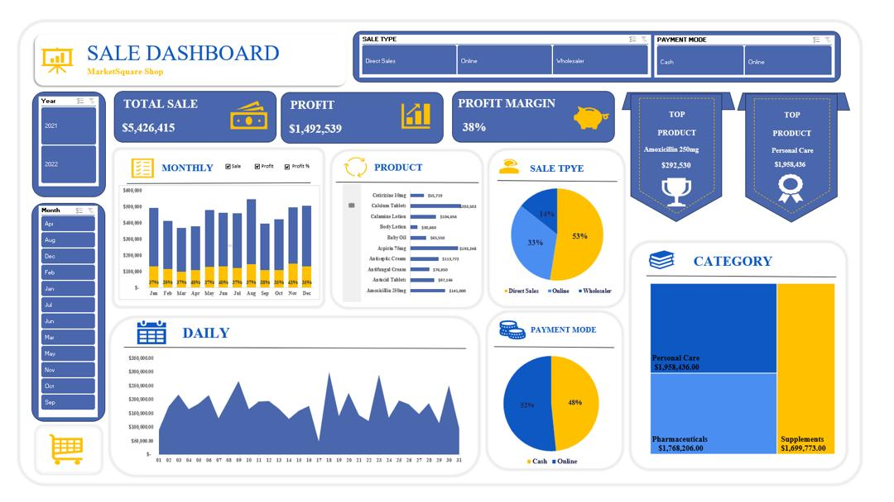

# MarketSquare Shop — Sales Dashboard (Excel)
 
**An interactive Excel dashboard tracking sales, profit, and product performance for MarketSquare Shop.**
 
Tool: **Microsoft Excel** (PivotTables, PivotCharts, Slicers)
 
---
 
## 📌 Project Overview
 
This dashboard consolidates MarketSquare Shop's sales data into a single, interactive **Excel** view for tracking revenue, profitability, and product performance. Built with PivotTables, PivotCharts, and slicers, it allows users to filter by **Year**, **Month**, **Sale Type**, and **Payment Mode** to explore sales trends, top-performing products, and category-level breakdowns — all without writing a single formula-heavy report from scratch each time.
 
---
 
## 🎯 Objectives
 
- Track total sales, profit, and profit margin at a glance
- Analyze monthly and daily sales trends across the year
- Identify top-performing products and product categories
- Break down sales by sale type (Direct Sales, Online, Wholesaler) and payment mode (Cash, Online)
- Enable interactive filtering by year and month for period-over-period analysis
- Surface the single best-selling product and top category by revenue
---
 
## 🗂 Dashboard Layout
 
| Section | Description |
|---------|-------------|
| **KPI Cards** | Total Sale, Profit, and Profit Margin at the top for an instant business snapshot |
| **Top Product Badges** | Highlights the top individual product and top category by revenue |
| **Monthly Chart** | Stacked column chart of Sale, Profit, and Profit % by month, with toggle checkboxes |
| **Daily Chart** | Area chart of daily sales across the month/period selected |
| **Product Breakdown** | Horizontal bar chart ranking all products by sales value |
| **Sale Type Chart** | Pie chart showing the split between Direct Sales, Online, and Wholesaler |
| **Payment Mode Chart** | Pie chart showing the split between Cash and Online payments |
| **Category Treemap** | Treemap visualizing revenue share across Personal Care, Pharmaceuticals, and Supplements |
| **Slicers** | Year and Month slicers for interactive filtering across the whole dashboard |
 
---
 
## 📊 Key Metrics (KPIs)
 
| Metric | Value |
|--------|-------|
| Total Sale | $5,426,415 |
| Profit | $1,492,539 |
| Profit Margin | 38% |
| Top Product | Amoxicillin 250mg — $292,530 |
| Top Category | Personal Care — $1,958,436 |
 
---
 
## 🔍 Key Findings
 
**Sales Channels**
- **Direct Sales** is the dominant channel at **53%** of total sales, followed by **Online (33%)** and **Wholesaler (14%)**
- Payment is fairly evenly split, with **Cash at 52%** and **Online at 48%**
**Product Performance**
- **Calcium Tablets** ($203,503) and **Aspirin 75mg** ($193,248) are the top individual line items by sales value
- **Amoxicillin 250mg** is the single top-performing product overall at **$292,530** (as shown in the Top Product badge, reflecting total company-wide sales across the full dataset)
- **Body Lotion** ($30,860) and **Cetirizine 10mg** ($55,719) are the lowest-selling products in the lineup
**Category Mix**
- **Personal Care** leads all categories with **$1,958,436** in sales
- **Pharmaceuticals** ($1,768,206) and **Supplements** ($1,699,773) follow closely behind, indicating a fairly balanced category mix rather than dependence on a single product line
**Trends**
- Monthly sales stay in a relatively tight band across the year, with profit percentage holding steady in the high-20s (approx. 27–29%) most months
- Daily sales fluctuate significantly day to day, suggesting demand is driven by specific high-volume days rather than a flat, predictable pattern
---
 
## 🛠 Tools & Skills Used
 
- **Microsoft Excel** — PivotTables and PivotCharts for dynamic aggregation
- **Slicers** — interactive Year and Month filtering
- **Data Visualization** — stacked column charts, area charts, pie charts, treemap, horizontal bar charts
- **Dashboard Design** — KPI cards, custom icons, and a clean single-page layout for at-a-glance reporting
---
 
## 📁 Repository Contents
 
```
├── MarketSquare_Sales_Dashboard.xlsx   # Excel source file (PivotTables, charts, slicers)
├── 01-sales-dashboard.jpeg             # Dashboard screenshot
└── README.md                           # Project documentation (this file)
```
 
---
 
## 📷 Dashboard Preview
 

 
---
 
## 📬 Contact
 
**MarketSquare Shop — Sales Analytics Project**
 


